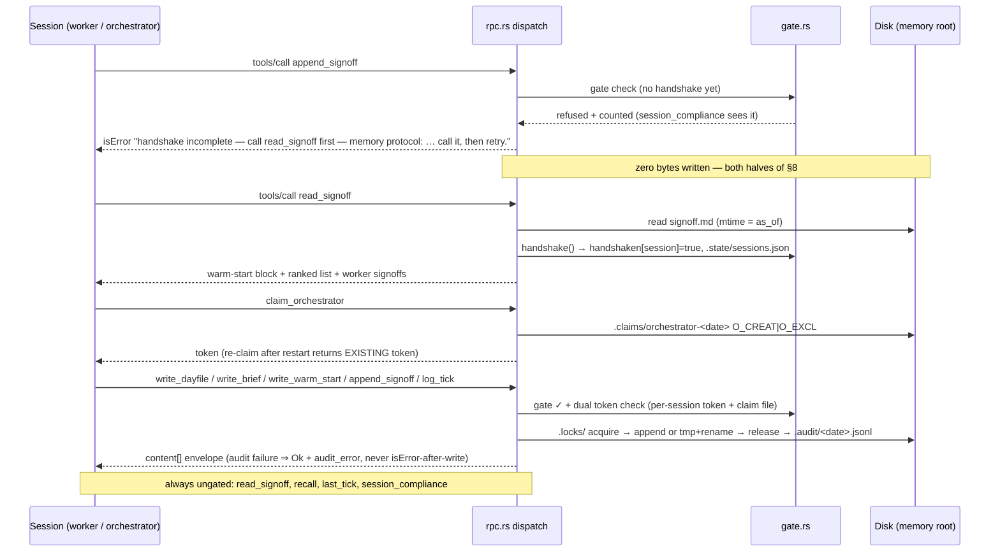
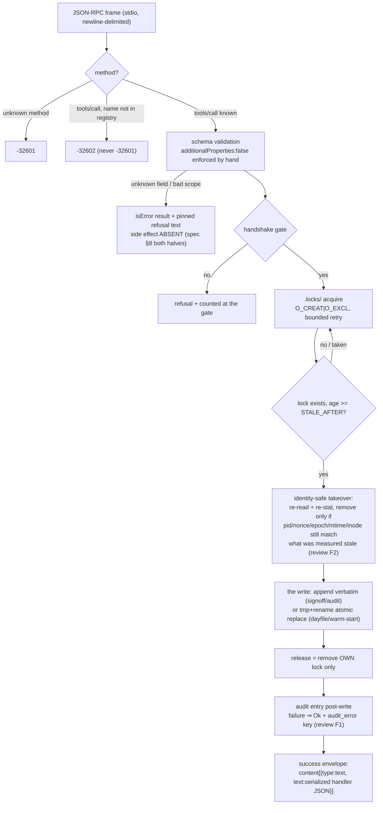
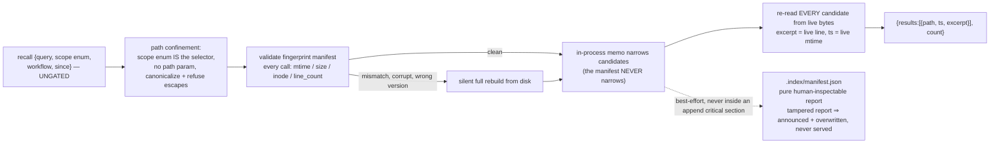
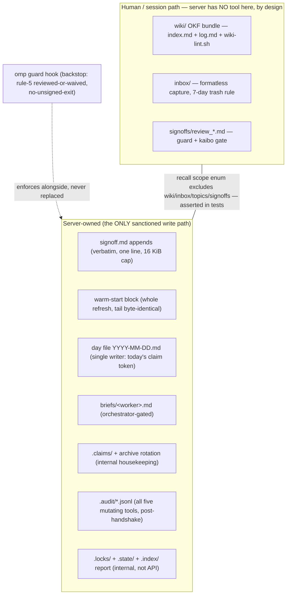

# total-recall — workflow diagrams

Companion view to `spec.md` (v0.3): how the workflows actually run, as built in commit 0a1a4b1.
The load-bearing reading: diagrams 2 and 3 encode the two invariants everything else hangs on —
a refusal never touches disk, and the index never answers from cache. Both are pinned by tests,
not by hope.

## 1. Session lifecycle — the handshake gate (spec §4)

## 2. Anatomy of one gated write — every layer a tool call crosses

## 3. Recall + the derived index — cache that can never become truth

## 4. Ownership planes — who writes what (absence IS the API)

